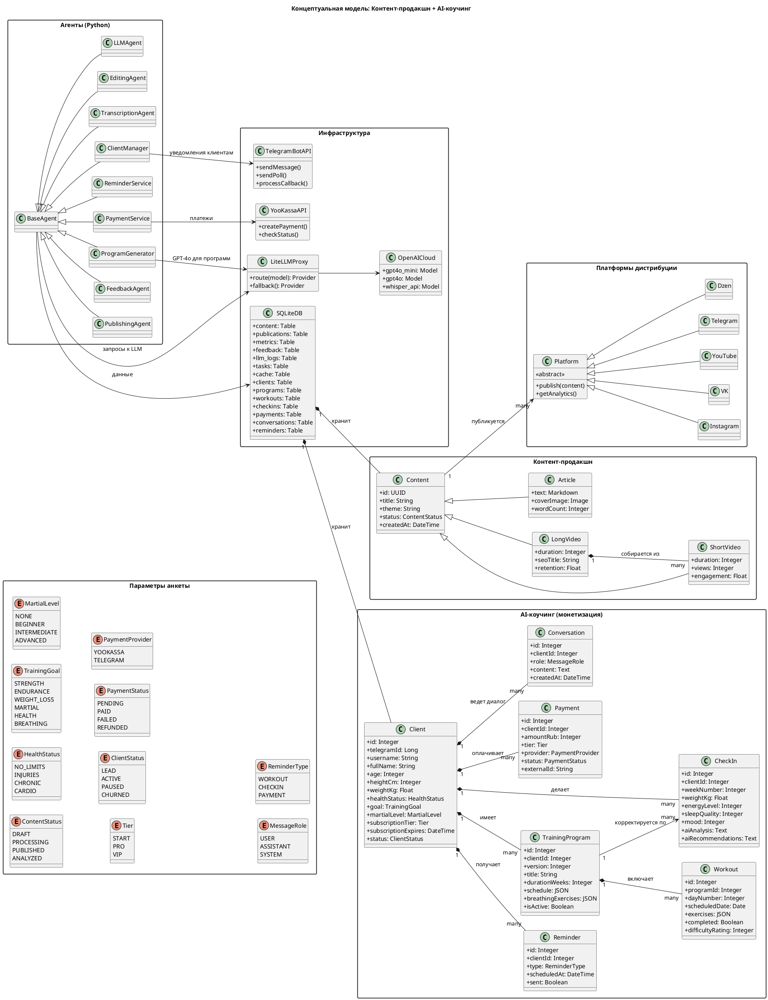

# Концепция

## Описание предметной области

Проект представляет собой комплексную систему автоматизированного контент-продакшна и мультиплатформенной дистрибуции, объединяющую:
Производство видеоконтента (короткие и длинные форматы)
Текстового контента (статьи на основе видео)
Мультиплатформенную дистрибуцию (Instagram, VK, YouTube, Telegram, Дзен)
Сбор и анализ обратной связи
Монетизацию через консультации и закрытые каналы

## Концептуальная модель предметной области (Class Diagram

