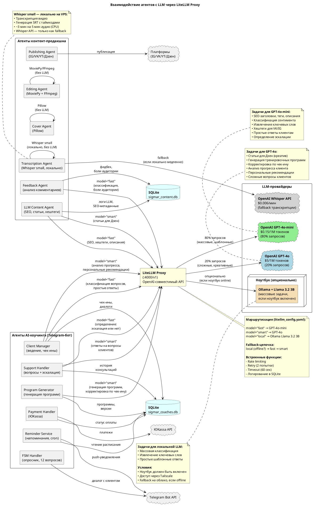
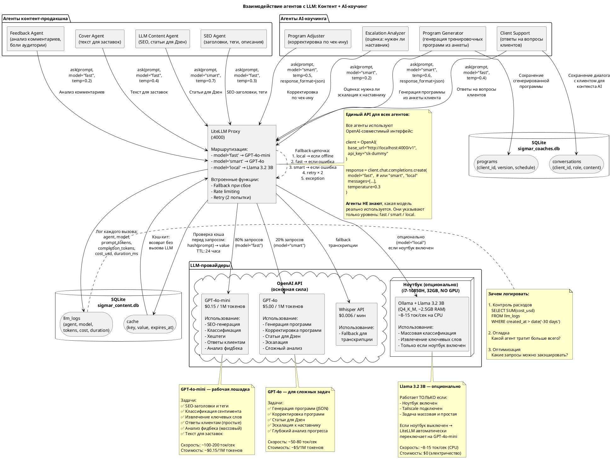

# Взаимодействие агентов и LLM

```puml
@startuml
left to right direction
skinparam componentStyle rectangle
skinparam packageStyle rectangle
title Взаимодействие агентов с LLM через LiteLLM Proxy

' === АГЕНТЫ КОНТЕНТ-ПРОДАКШНА ===
package "Агенты контент-продакшна" as ContentAgents {
    component "Transcription Agent\n(Whisper small, локально)" as TransAg
    component "Editing Agent\n(MoviePy + FFmpeg)" as EditAg
    component "Cover Agent\n(Pillow)" as CoverAg
    component "LLM Content Agent\n(SEO, статьи, хештеги)" as LLMAg
    component "Publishing Agent\n(IG/VK/YT/Дзен)" as PubAg
    component "Feedback Agent\n(анализ комментариев)" as FeedAg
}

' === АГЕНТЫ AI-КОУЧИНГА ===
package "Агенты AI-коучинга (Telegram-бот)" as CoachAgents {
    component "FSM Handler\n(опросник, 12 вопросов)" as FSM
    component "Program Generator\n(генерация программ)" as ProgGen
    component "Client Manager\n(ведение, чек-ины)" as CM
    component "Reminder Service\n(напоминания, cron)" as Rem
    component "Support Handler\n(вопросы + эскалация)" as Sup
    component "Payment Handler\n(ЮKassa)" as PayH
}

' === ЕДИНАЯ ТОЧКА ВХОДА ===
component "**LiteLLM Proxy**\n(:4000/v1)\nOpenAI-совместимый API" as Router #LightYellow

' === LLM-ПРОВАЙДЕРЫ ===
package "LLM-провайдеры" as Providers {
    cloud "**OpenAI GPT-4o-mini**\n$0.15/1M токенов\n(80% запросов)" as Fast #LightGreen
    cloud "**OpenAI GPT-4o**\n$5/1M токенов\n(20% запросов)" as Smart #LightBlue
    cloud "**OpenAI Whisper API**\n$0.006/мин\n(fallback транскрипции)" as WhisperAPI #LightGray
    
    node "Ноутбук (опционально)" as LaptopNode {
        component "**Ollama + Llama 3.2 3B**\n(массовые задачи,\nесли ноутбук включен)" as LocalLLM #Wheat
    }
}

' === ХРАНИЛИЩЕ ===
database "**SQLite**\nsigmar_content.db" as DB_Content #LightCyan
database "**SQLite**\nsigmar_coaches.db" as DB_Coach #LightCyan

' === ВНЕШНИЕ СЕРВИСЫ ===
cloud "Telegram Bot API" as TG_API
cloud "ЮKassa API" as YK
cloud "Платформы\n(IG/VK/YT/Дзен)" as Platforms

' === СВЯЗИ: Контент-агенты → LiteLLM ===
LLMAg --> Router : model="fast"\n(SEO, хештеги, описания)
LLMAg --> Router : model="smart"\n(статьи для Дзен)
FeedAg --> Router : model="fast"\n(классификация,\nболи аудитории)
TransAg --> WhisperAPI : fallback\n(если локально медленно)

' === СВЯЗИ: Коучинг-агенты → LiteLLM ===
ProgGen --> Router : model="smart"\n(генерация программ,\nкорректировка по чек-ину)
CM --> Router : model="smart"\n(анализ прогресса,\nперсональные рекомендации)
CM --> Router : model="fast"\n(классификация вопросов,\nпростые ответы)
Sup --> Router : model="smart"\n(ответы на вопросы\nклиентов)
Sup --> Router : model="fast"\n(определение:\nэскалация или нет)

' === СВЯЗИ: LiteLLM → Провайдеры ===
Router --> Fast : 80% запросов\n(массовые, шаблонные)
Router --> Smart : 20% запросов\n(сложные, креативные)
Router --> LocalLLM : опционально\n(если ноутбук online)

' === СВЯЗИ: Агенты → Хранилище ===
LLMAg --> DB_Content : логи LLM,\nSEO-метаданные
FeedAg --> DB_Content : фидбек,\nболи аудитории
ProgGen --> DB_Coach : программы,\nверсии
CM --> DB_Coach : чек-ины,\nдиалоги
Sup --> DB_Coach : история\nконсультаций

' === СВЯЗИ: Агенты → Внешние сервисы ===
PubAg --> Platforms : публикация
PayH --> YK : платежи
Rem --> TG_API : push-уведомления
FSM --> TG_API : диалог с клиентом

' === СВЯЗИ: Агенты без LLM ===
EditAg --> EditAg : MoviePy/FFmpeg\n(без LLM)
CoverAg --> CoverAg : Pillow\n(без LLM)
TransAg --> TransAg : Whisper small\n(локально, без LLM)
Rem --> DB_Coach : чтение расписания
PayH --> DB_Coach : статус оплаты

' === ПРИМЕЧАНИЯ ===
note right of Router
  **Маршрутизация (litellm_config.yaml):**
  
  model="fast" → GPT-4o-mini
  model="smart" → GPT-4o
  model="local" → Ollama Llama 3.2 3B
  
  **Fallback-цепочка:**
  local (offline?) → fast → smart
  
  **Встроенные функции:**
  - Rate limiting
  - Retry (2 попытки)
  - Timeout (60 сек)
  - Логирование в SQLite
end note

note bottom of Fast
  **Задачи для GPT-4o-mini:**
  • SEO-заголовки, теги, описания
  • Классификация сентимента
  • Извлечение ключевых слов
  • Хештеги для VK/IG
  • Простые ответы клиентам
  • Определение эскалации
end note

note bottom of Smart
  **Задачи для GPT-4o:**
  • Статьи для Дзен (креатив)
  • Генерация тренировочных программ
  • Корректировка по чек-ину
  • Анализ прогресса клиента
  • Персональные рекомендации
  • Сложные вопросы клиентов
end note

note left of LocalLLM
  **Задачи для локальной LLM:**
  • Массовая классификация
  • Извлечение ключевых слов
  • Простые шаблонные ответы
  
  **Условия:**
  • Ноутбук должен быть включен
  • Доступ через Tailscale
  • Fallback на облако, если offline
end note

note bottom of TransAg
  **Whisper small — локально на VPS:**
  • Транскрипция видео
  • Генерация SRT с таймкодами
  • ~3 мин на 5 мин аудио (CPU)
  • Whisper API — только как fallback
end note

@enduml
```

```puml
@startuml
title Взаимодействие агентов с LLM: Контент + AI-коучинг

skinparam componentStyle rectangle
skinparam noteBackgroundColor #FFFFCC

' === АГЕНТЫ ===

package "Агенты контент-продакшна" as ContentAgents {
    component "LLM Content Agent\n(SEO, статьи для Дзен)" as LLMAg
    component "SEO Agent\n(заголовки, теги, описания)" as SEOAg
    component "Feedback Agent\n(анализ комментариев,\nболи аудитории)" as FeedAg
    component "Cover Agent\n(текст для заставок)" as CoverAg
}

package "Агенты AI-коучинга" as CoachAgents {
    component "Program Generator\n(генерация тренировочных\nпрограмм из анкеты)" as ProgGen
    component "Program Adjuster\n(корректировка по чек-ину)" as ProgAdj
    component "Client Support\n(ответы на вопросы\nклиентов)" as SupAg
    component "Escalation Analyzer\n(оценка: нужен ли\nнаставник)" as EscAg
}

' === ЕДИНАЯ ТОЧКА ВХОДА ===

component "LiteLLM Proxy\n(:4000)\n\nМаршрутизация:\n- model='fast' → GPT-4o-mini\n- model='smart' → GPT-4o\n- model='local' → Llama 3.2 3B\n\nВстроенные функции:\n- Fallback при сбое\n- Rate limiting\n- Retry (2 попытки)" as Router

' === LLM-ПРОВАЙДЕРЫ ===

package "LLM-провайдеры" {
    cloud "OpenAI API\n(основная сила)" as OAI {
        component "GPT-4o-mini\n$0.15 / 1M токенов\n\nИспользование:\n- SEO-генерация\n- Классификация\n- Хештеги\n- Ответы клиентам\n- Анализ фидбека" as Fast
        
        component "GPT-4o\n$5.00 / 1M токенов\n\nИспользование:\n- Генерация программ\n- Корректировка программ\n- Статьи для Дзен\n- Эскалация\n- Сложный анализ" as Smart
        
        component "Whisper API\n$0.006 / мин\n\nИспользование:\n- Fallback для\n  транскрипции" as WhisperAPI
    }
    
    node "Ноутбук (опционально)\n(i7-10850H, 32GB, NO GPU)" as Laptop {
        component "Ollama + Llama 3.2 3B\n(Q4_K_M, ~2.5GB RAM)\n~8-15 ток/сек на CPU\n\nИспользование:\n- Массовая классификация\n- Извлечение ключевых слов\n- Только если ноутбук включен" as Local
    }
}

' === ХРАНИЛИЩЕ ===

database "SQLite\nsigmar_content.db" as DB_Content {
    storage "llm_logs\n(agent, model,\ntokens, cost, duration)" as Logs
    storage "cache\n(key, value, expires_at)" as Cache
}

database "SQLite\nsigmar_coaches.db" as DB_Coach {
    storage "conversations\n(client_id, role, content)" as Conv
    storage "programs\n(client_id, version, schedule)" as Progs
}

' === СВЯЗИ: АГЕНТЫ КОНТЕНТА → LITE LLM ===

LLMAg --> Router : ask(prompt,\nmodel="smart",\ntemp=0.7)\n\nСтатьи для Дзен
SEOAg --> Router : ask(prompt,\nmodel="fast",\ntemp=0.3)\n\nSEO-заголовки, теги
FeedAg --> Router : ask(prompt,\nmodel="fast",\ntemp=0.2)\n\nАнализ комментариев
CoverAg --> Router : ask(prompt,\nmodel="fast",\ntemp=0.4)\n\nТекст для заставок

' === СВЯЗИ: АГЕНТЫ КОУЧИНГА → LITE LLM ===

ProgGen --> Router : ask(prompt,\nmodel="smart",\ntemp=0.6,\nresponse_format=json)\n\nГенерация программы\nиз анкеты клиента
ProgAdj --> Router : ask(prompt,\nmodel="smart",\ntemp=0.5,\nresponse_format=json)\n\nКорректировка\nпо чек-ину
SupAg --> Router : ask(prompt,\nmodel="fast",\ntemp=0.4)\n\nОтветы на вопросы\nклиентов
EscAg --> Router : ask(prompt,\nmodel="smart",\ntemp=0.2)\n\nОценка: нужна ли\nэскалация к наставнику

' === МАРШРУТИЗАЦИЯ ===

Router --> Fast : 80% запросов\n(model="fast")
Router --> Smart : 20% запросов\n(model="smart")
Router --> WhisperAPI : fallback\nтранскрипции
Router --> Local : опционально\n(model="local")\nесли ноутбук включен

' === FALLBACK ЛОГИКА ===

Router ..> Router : Fallback-цепочка:\n1. local → если offline\n2. fast → если ошибка\n3. smart → если ошибка\n4. retry × 2\n5. exception

' === ЛОГИРОВАНИЕ И КЭШИРОВАНИЕ ===

Router --> Logs : Лог каждого вызова:\nagent, model,\nprompt_tokens,\ncompletion_tokens,\ncost_usd, duration_ms
Router --> Cache : Проверка кэша\nперед запросом:\nhash(prompt) → value\nTTL: 24 часа
Cache --> Router : Кэш-хит:\nвозврат без\nвызова LLM

' === СОХРАНЕНИЕ КОНТЕКСТА КОУЧИНГА ===

SupAg --> Conv : Сохранение диалога\nс клиентом для\nконтекста AI
ProgGen --> Progs : Сохранение\nсгенерированной\nпрограммы

note right of Router
  **Единый API для всех агентов:**
  
  Все агенты используют
  OpenAI-совместимый интерфейс:
  
  client = OpenAI(
    base_url="http://localhost:4000/v1",
    api_key="sk-dummy"
  )
  
  response = client.chat.completions.create(
    model="fast",  # или "smart", "local"
    messages=[...],
    temperature=0.3
  )
  
  **Агенты НЕ знают**, какая модель
  реально используется. Они указывают
  только уровень: fast / smart / local.
end note

note bottom of Fast
  **GPT-4o-mini — рабочая лошадка**
  
  Задачи:
  ✅ SEO-заголовки и теги
  ✅ Классификация сентимента
  ✅ Извлечение ключевых слов
  ✅ Ответы клиентам (простые)
  ✅ Анализ фидбека (массовый)
  ✅ Текст для заставок
  
  Скорость: ~100-200 ток/сек
  Стоимость: ~$0.15/1M токенов
end note

note bottom of Smart
  **GPT-4o — для сложных задач**
  
  Задачи:
  ✅ Генерация программ (JSON)
  ✅ Корректировка программ
  ✅ Статьи для Дзен
  ✅ Эскалация к наставнику
  ✅ Глубокий анализ прогресса
  
  Скорость: ~50-80 ток/сек
  Стоимость: ~$5/1M токенов
end note

note bottom of Local
  **Llama 3.2 3B — опционально**
  
  Работает ТОЛЬКО если:
  - Ноутбук включен
  - Tailscale подключен
  - Задача массовая и простая
  
  Если ноутбук выключен →
  LiteLLM автоматически
  переключает на GPT-4o-mini
  
  Скорость: ~8-15 ток/сек (CPU)
  Стоимость: $0 (электричество)
end note

note right of Logs
  **Зачем логировать:**
  
  1. Контроль расходов
     SELECT SUM(cost_usd) 
     FROM llm_logs
     WHERE created_at > date('-30 days')
  
  2. Отладка
     Какой агент тратит больше всего?
  
  3. Оптимизация
     Какие запросы можно закэшировать?
end note

@enduml
```