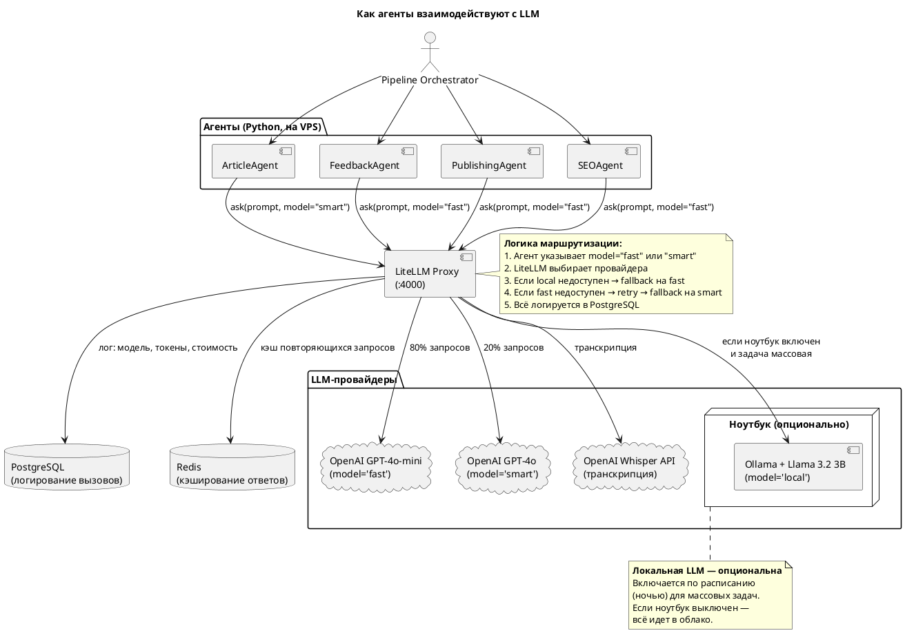

# Взаимодействие агентов и LLM

```puml
@startuml
title Как агенты взаимодействуют с LLM

actor "Pipeline Orchestrator" as Orch

package "Агенты (Python, на VPS)" {
    component "ArticleAgent" as AA
    component "FeedbackAgent" as FA
    component "PublishingAgent" as PA
    component "SEOAgent" as SA
}

component "LiteLLM Proxy\n(:4000)" as Router

package "LLM-провайдеры" {
    cloud "OpenAI GPT-4o-mini\n(model='fast')" as Fast
    cloud "OpenAI GPT-4o\n(model='smart')" as Smart
    cloud "OpenAI Whisper API\n(транскрипция)" as WhisperAPI
    
    node "Ноутбук (опционально)" as Laptop {
        component "Ollama + Llama 3.2 3B\n(model='local')" as Local
    }
}

database "PostgreSQL\n(логирование вызовов)" as DB
database "Redis\n(кэширование ответов)" as Cache

Orch --> AA
Orch --> FA
Orch --> PA
Orch --> SA

AA --> Router : ask(prompt, model="smart")
FA --> Router : ask(prompt, model="fast")
PA --> Router : ask(prompt, model="fast")
SA --> Router : ask(prompt, model="fast")

Router --> Fast : 80% запросов
Router --> Smart : 20% запросов
Router --> WhisperAPI : транскрипция
Router --> Local : если ноутбук включен\nи задача массовая

Router --> DB : лог: модель, токены, стоимость
Router --> Cache : кэш повторяющихся запросов

note right of Router
  **Логика маршрутизации:**
  1. Агент указывает model="fast" или "smart"
  2. LiteLLM выбирает провайдера
  3. Если local недоступен → fallback на fast
  4. Если fast недоступен → retry → fallback на smart
  5. Всё логируется в PostgreSQL
end note

note bottom of Laptop
  **Локальная LLM — опциональна**
  Включается по расписанию
  (ночью) для массовых задач.
  Если ноутбук выключен —
  всё идет в облако.
end note

@enduml
```