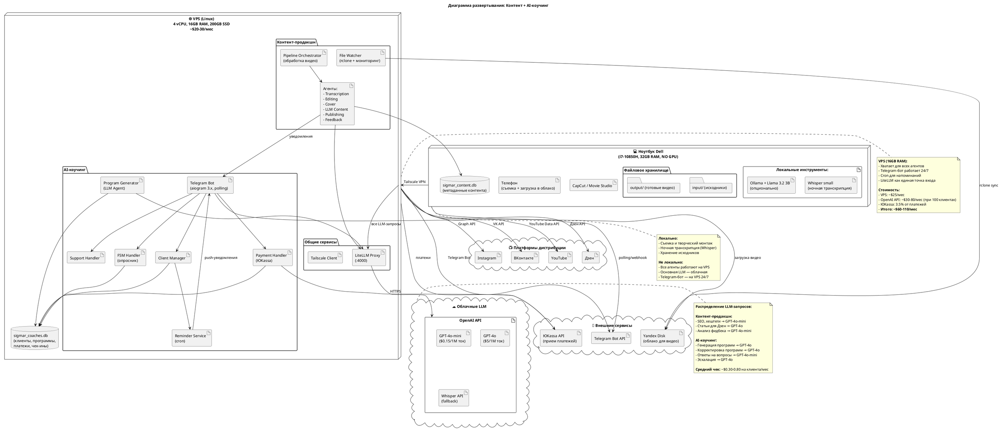

# Диаграмма развертывания

```puml
@startuml
title Диаграмма развертывания: Контент + AI-коучинг

node "💻 Ноутбук Dell\n(i7-10850H, 32GB RAM, NO GPU)" as Laptop {
    artifact "CapCut / Movie Studio" as Editor
    artifact "Телефон\n(съемка + загрузка в облако)" as Phone
    
    artifact "Локальные инструменты:" as LocalTools {
        artifact "Whisper small\n(ночная транскрипция)" as Whisper
        artifact "Ollama + Llama 3.2 3B\n(опционально)" as Ollama
    }
    
    database "sigmar_content.db\n(метаданные контента)" as DB_Content
    
    folder "Файловое хранилище" as LocalFS {
        folder "input/ (исходники)" as In
        folder "output/ (готовые видео)" as Out
    }
}

node "🌐 VPS (Linux)\n4 vCPU, 16GB RAM, 200GB SSD\n~$20-30/мес" as VPS {
    
    package "Контент-продакшн" {
        artifact "File Watcher\n(rclone + мониторинг)" as Watcher
        artifact "Pipeline Orchestrator\n(обработка видео)" as Pipeline
        artifact "Агенты:\n- Transcription\n- Editing\n- Cover\n- LLM Content\n- Publishing\n- Feedback" as ContentAgents
    }
    
    package "AI-коучинг" {
        artifact "Telegram Bot\n(aiogram 3.x, polling)" as TGBot
        artifact "FSM Handler\n(опросник)" as FSM
        artifact "Payment Handler\n(ЮKassa)" as PayH
        artifact "Program Generator\n(LLM Agent)" as ProgGen
        artifact "Client Manager" as CM
        artifact "Reminder Service\n(cron)" as Rem
        artifact "Support Handler" as Sup
    }
    
    package "Общие сервисы" {
        artifact "LiteLLM Proxy\n(:4000)" as Router
        artifact "Tailscale Client" as TS
    }
    
    database "sigmar_coaches.db\n(клиенты, программы,\nплатежи, чек-ины)" as DB_Coach
}

cloud "☁️ Облачные LLM" as CloudLLM {
    artifact "OpenAI API" as OAI {
        artifact "GPT-4o-mini\n($0.15/1M ток)" as GPT4oMini
        artifact "GPT-4o\n($5/1M ток)" as GPT4o
        artifact "Whisper API\n(fallback)" as WhisperAPI
    }
}

cloud "📱 Внешние сервисы" as External {
    artifact "Telegram Bot API" as TG_API
    artifact "ЮKassa API\n(прием платежей)" as YK
    artifact "Yandex Disk\n(облако для видео)" as Cloud
}

cloud "📺 Платформы дистрибуции" as Platforms {
    artifact "Instagram" as IG
    artifact "ВКонтакте" as VK
    artifact "YouTube" as YT
    artifact "Дзен" as DZ
}

' Связи
Laptop --> VPS : Tailscale VPN
Laptop --> Cloud : загрузка видео
Watcher --> Cloud : rclone sync

VPS --> Router : все LLM-запросы
Router --> OAI : HTTPS

VPS --> TG_API : Telegram Bot
VPS --> YK : платежи
VPS --> IG : Graph API
VPS --> VK : VK API
VPS --> YT : YouTube Data API
VPS --> DZ : Дзен API

TGBot --> TG_API : polling/webhook
TGBot --> FSM
TGBot --> PayH
TGBot --> CM
TGBot --> Sup

FSM --> DB_Coach
PayH --> YK
PayH --> DB_Coach
ProgGen --> Router
ProgGen --> DB_Coach
CM --> DB_Coach
CM --> Rem
Rem --> TGBot : push-уведомления

Pipeline --> ContentAgents
ContentAgents --> Router
ContentAgents --> DB_Content
ContentAgents --> TGBot : уведомления

note right of VPS
  **VPS (16GB RAM):**
  - Хватает для всех агентов
  - Telegram-бот работает 24/7
  - Cron для напоминаний
  - LiteLLM как единая точка входа
  
  **Стоимость:**
  - VPS: ~$25/мес
  - OpenAI API: ~$30-80/мес (при 100 клиентах)
  - ЮKassa: 3.5% от платежей
  - **Итого: ~$60-110/мес**
end note

note bottom of Laptop
  **Локально:**
  - Съемка и творческий монтаж
  - Ночная транскрипция (Whisper)
  - Хранение исходников
  
  **Не локально:**
  - Все агенты работают на VPS
  - Основная LLM — облачная
  - Telegram-бот — на VPS 24/7
end note

note right of CloudLLM
  **Распределение LLM-запросов:**
  
  **Контент-продакшн:**
  - SEO, хештеги → GPT-4o-mini
  - Статьи для Дзен → GPT-4o
  - Анализ фидбека → GPT-4o-mini
  
  **AI-коучинг:**
  - Генерация программ → GPT-4o
  - Корректировка программ → GPT-4o
  - Ответы на вопросы → GPT-4o-mini
  - Эскалация → GPT-4o
  
  **Средний чек:** ~$0.30-0.80 на клиента/мес
end note

@enduml
```