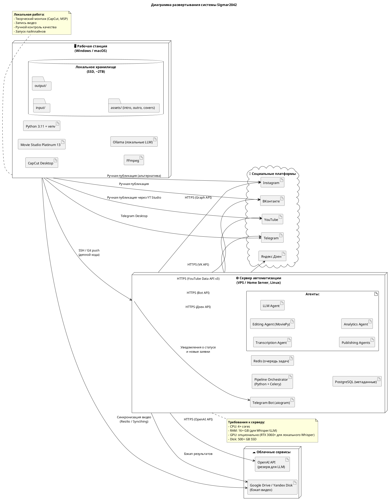
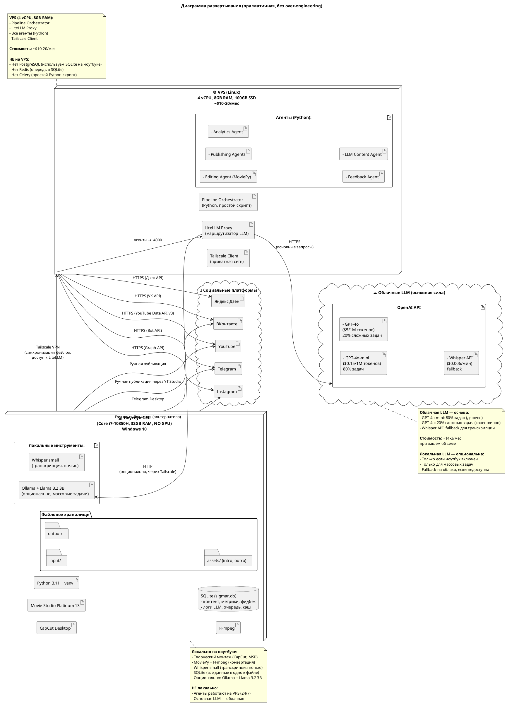

# Диаграмма развертывания

```puml
@startuml
left to right direction
title Диаграмма развертывания системы Sigmar2042

node "🖥️ Рабочая станция\n(Windows / macOS)" as WS {
    artifact "CapCut Desktop" as CapCut
    artifact "Movie Studio Platinum 13" as MSP
    artifact "Python 3.11 + venv" as PyEnv
    artifact "FFmpeg" as FFmpeg
    artifact "Ollama (локальные LLM)" as Ollama
    
    database "Локальное хранилище\n(SSD, ~2TB)" as LocalFS {
        folder "input/" as In
        folder "output/" as Out
        folder "assets/ (intro, outro, covers)" as Assets
    }
}

node "🌐 Сервер автоматизации\n(VPS / Home Server, Linux)" as Server {
    artifact "Pipeline Orchestrator\n(Python + Celery)" as Orch
    artifact "Redis (очередь задач)" as Redis
    artifact "PostgreSQL (метаданные)" as PG
    artifact "Telegram Bot (aiogram)" as TGBot
    
    artifact "Агенты:" as Agents {
        artifact "Transcription Agent" as TA
        artifact "Editing Agent (MoviePy)" as EA
        artifact "LLM Agent" as LA
        artifact "Publishing Agents" as PA
        artifact "Analytics Agent" as AA
    }
}

node "☁️ Облачные сервисы" as Cloud {
    artifact "OpenAI API\n(резерв для LLM)" as OAI
    artifact "Google Drive / Yandex Disk\n(бэкап видео)" as CloudFS
}

cloud "📱 Социальные платформы" as Platforms {
    artifact "Instagram" as IG
    artifact "ВКонтакте" as VK
    artifact "YouTube" as YT
    artifact "Telegram" as TG
    artifact "Яндекс Дзен" as DZ
}

' Связи
WS --> Server : SSH / Git push\n(деплой кода)
WS --> CloudFS : Синхронизация видео\n(Resilio / Syncthing)

Server --> OAI : HTTPS (OpenAI API)
Server --> CloudFS : Бэкап результатов

Server --> IG : HTTPS (Graph API)
Server --> VK : HTTPS (VK API)
Server --> YT : HTTPS (YouTube Data API v3)
Server --> TG : HTTPS (Bot API)
Server --> DZ : HTTPS (Дзен API)

WS --> IG : Ручная публикация (альтернатива)
WS --> VK : Ручная публикация
WS --> YT : Ручная публикация через YT Studio
WS --> TG : Telegram Desktop

Server --> TGBot : Уведомления о статусе\nи новые заявки

note right of Server
  **Требования к серверу:**
  - CPU: 4+ cores
  - RAM: 16+ GB (для Whisper/LLM)
  - GPU: опционально (RTX 3060+ для локального Whisper)
  - Disk: 500+ GB SSD
end note

note bottom of WS
  **Локальная работа:**
  - Творческий монтаж (CapCut, MSP)
  - Запись видео
  - Ручной контроль качества
  - Запуск пайплайнов
end note

@enduml
```

```puml
@startuml
left to right direction
title Диаграмма развертывания (прагматичная, без over-engineering)

node "💻 Ноутбук Dell\n(Core i7-10850H, 32GB RAM, NO GPU)\nWindows 10" as Laptop {
    artifact "CapCut Desktop" as CapCut
    artifact "Movie Studio Platinum 13" as MSP
    artifact "Python 3.11 + venv" as PyEnv
    artifact "FFmpeg" as FFmpeg
    
    artifact "Локальные инструменты:" as LocalTools {
        artifact "Whisper small\n(транскрипция, ночью)" as Whisper
        artifact "Ollama + Llama 3.2 3B\n(опционально, массовые задачи)" as Ollama
    }
    
    database "SQLite (sigmar.db)\n- контент, метрики, фидбек\n- логи LLM, очередь, кэш" as SQLiteDB
    
    folder "Файловое хранилище" as LocalFS {
        folder "input/" as In
        folder "output/" as Out
        folder "assets/ (intro, outro)" as Assets
    }
}

node "🌐 VPS (Linux)\n4 vCPU, 8GB RAM, 100GB SSD\n~$10-20/мес" as VPS {
    artifact "Pipeline Orchestrator\n(Python, простой скрипт)" as Orch
    
    artifact "LiteLLM Proxy\n(маршрутизатор LLM)" as Router
    
    artifact "Агенты (Python):" as Agents {
        artifact "- Editing Agent (MoviePy)" as EA
        artifact "- Publishing Agents" as PA
        artifact "- Analytics Agent" as AA
        artifact "- Feedback Agent" as FA
        artifact "- LLM Content Agent" as LA
    }
    
    artifact "Tailscale Client\n(приватная сеть)" as TS_VPS
}

cloud "☁️ Облачные LLM (основная сила)" as CloudLLM {
    artifact "OpenAI API" as OAI {
        artifact "- GPT-4o-mini\n($0.15/1M токенов)\n80% задач" as GPT4oMini
        artifact "- GPT-4o\n($5/1M токенов)\n20% сложных задач" as GPT4o
        artifact "- Whisper API\n($0.006/мин)\nfallback" as WhisperAPI
    }
}

cloud "📱 Социальные платформы" as Platforms {
    artifact "Instagram" as IG
    artifact "ВКонтакте" as VK
    artifact "YouTube" as YT
    artifact "Telegram" as TG
    artifact "Яндекс Дзен" as DZ
}

' Связи
Laptop --> VPS : Tailscale VPN\n(синхронизация файлов,\nдоступ к LiteLLM)

VPS --> Router : Агенты → :4000
Router --> OAI : HTTPS\n(основные запросы)
Router --> Ollama : HTTP\n(опционально, через Tailscale)

VPS --> IG : HTTPS (Graph API)
VPS --> VK : HTTPS (VK API)
VPS --> YT : HTTPS (YouTube Data API v3)
VPS --> TG : HTTPS (Bot API)
VPS --> DZ : HTTPS (Дзен API)

Laptop --> IG : Ручная публикация (альтернатива)
Laptop --> VK : Ручная публикация
Laptop --> YT : Ручная публикация через YT Studio
Laptop --> TG : Telegram Desktop

note right of Laptop
  **Локально на ноутбуке:**
  - Творческий монтаж (CapCut, MSP)
  - MoviePy + FFmpeg (конвертация)
  - Whisper small (транскрипция ночью)
  - SQLite (все данные в одном файле)
  - Опционально: Ollama + Llama 3.2 3B
  
  **НЕ локально:**
  - Агенты работают на VPS (24/7)
  - Основная LLM — облачная
end note

note bottom of VPS
  **VPS (4 vCPU, 8GB RAM):**
  - Pipeline Orchestrator
  - LiteLLM Proxy
  - Все агенты (Python)
  - Tailscale Client
  
  **Стоимость:** ~$10-20/мес
  
  **НЕ на VPS:**
  - Нет PostgreSQL (используем SQLite на ноутбуке)
  - Нет Redis (очередь в SQLite)
  - Нет Celery (простой Python-скрипт)
end note

note right of CloudLLM
  **Облачная LLM — основа:**
  - GPT-4o-mini: 80% задач (дешево)
  - GPT-4o: 20% сложных задач (качественно)
  - Whisper API: fallback для транскрипции
  
  **Стоимость:** ~$1-3/мес
  при вашем объеме
  
  **Локальная LLM — опциональна:**
  - Только если ноутбук включен
  - Только для массовых задач
  - Fallback на облако, если недоступна
end note

@enduml
```