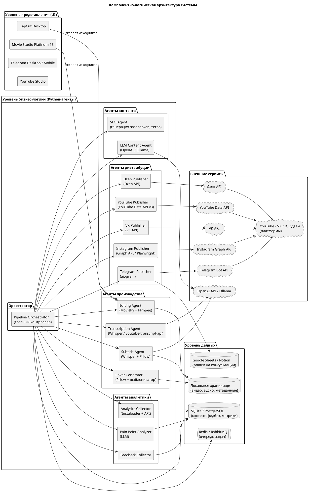
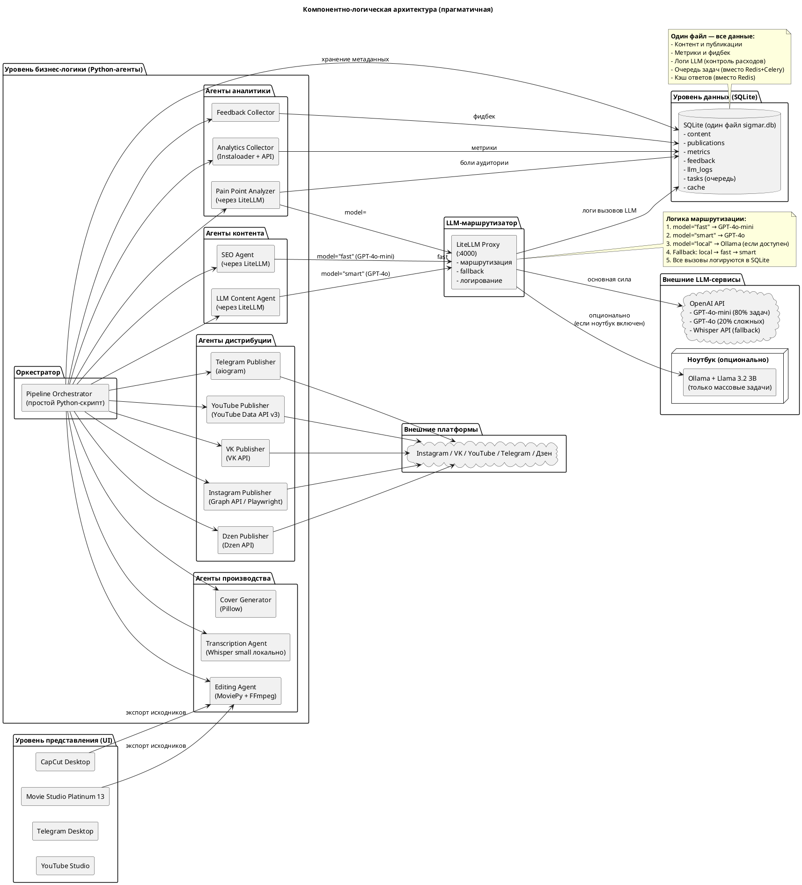

# Компонентно-логическая диаграмма

```puml
@startuml
left to right direction
skinparam componentStyle rectangle
title Компонентно-логическая архитектура системы

package "Уровень представления (UI)" {
    [CapCut Desktop] as CapCut
    [Movie Studio Platinum 13] as MSP
    [Telegram Desktop / Mobile] as TG_UI
    [YouTube Studio] as YT_UI
}

package "Уровень бизнес-логики (Python-агенты)" {
    
    package "Оркестратор" {
        [Pipeline Orchestrator\n(главный контроллер)] as Orchestrator
    }
    
    package "Агенты производства" {
        [Transcription Agent\n(Whisper / youtube-transcript-api)] as TranscriptionAgent
        [Editing Agent\n(MoviePy + FFmpeg)] as EditingAgent
        [Subtitle Agent\n(Whisper + Pillow)] as SubtitleAgent
        [Cover Generator\n(Pillow + шаблонизатор)] as CoverGen
    }
    
    package "Агенты контента" {
        [LLM Content Agent\n(OpenAI / Ollama)] as LLMAgent
        [SEO Agent\n(генерация заголовков, тегов)] as SEOAgent
    }
    
    package "Агенты дистрибуции" {
        [Instagram Publisher\n(Graph API / Playwright)] as IG_Pub
        [VK Publisher\n(VK API)] as VK_Pub
        [YouTube Publisher\n(YouTube Data API v3)] as YT_Pub
        [Telegram Publisher\n(aiogram)] as TG_Pub
        [Dzen Publisher\n(Dzen API)] as Dzen_Pub
    }
    
    package "Агенты аналитики" {
        [Analytics Collector\n(Instaloader + API)] as Analytics
        [Feedback Collector] as FeedbackColl
        [Pain Point Analyzer\n(LLM)] as PainAnalyzer
    }
}

package "Уровень данных" {
    database "Локальное хранилище\n(видео, аудио, метаданные)" as LocalStorage
    database "SQLite / PostgreSQL\n(контент, фидбек, метрики)" as DB
    database "Google Sheets / Notion\n(заявки на консультации)" as CRM
    queue "Redis / RabbitMQ\n(очередь задач)" as Queue
}

package "Внешние сервисы" {
    cloud "OpenAI API / Ollama" as LLM_Service
    cloud "YouTube Data API" as YT_API
    cloud "VK API" as VK_API
    cloud "Instagram Graph API" as IG_API
    cloud "Telegram Bot API" as TG_API
    cloud "Дзен API" as Dzen_API
    cloud "YouTube / VK / IG / Дзен\n(платформы)" as Platforms
}

' Связи UI -> Агенты
CapCut --> EditingAgent : экспорт исходников
MSP --> EditingAgent : экспорт исходников

' Оркестратор управляет агентами
Orchestrator --> TranscriptionAgent
Orchestrator --> EditingAgent
Orchestrator --> SubtitleAgent
Orchestrator --> CoverGen
Orchestrator --> LLMAgent
Orchestrator --> SEOAgent
Orchestrator --> IG_Pub
Orchestrator --> VK_Pub
Orchestrator --> YT_Pub
Orchestrator --> TG_Pub
Orchestrator --> Dzen_Pub
Orchestrator --> Analytics
Orchestrator --> FeedbackColl
Orchestrator --> PainAnalyzer

' Агенты -> внешние сервисы
TranscriptionAgent --> LLM_Service
LLMAgent --> LLM_Service
SubtitleAgent --> LLM_Service

IG_Pub --> IG_API
VK_Pub --> VK_API
YT_Pub --> YT_API
TG_Pub --> TG_API
Dzen_Pub --> Dzen_API

IG_API --> Platforms
VK_API --> Platforms
YT_API --> Platforms
TG_API --> Platforms
Dzen_API --> Platforms

' Агенты -> хранилища
EditingAgent --> LocalStorage
SubtitleAgent --> LocalStorage
CoverGen --> LocalStorage
Orchestrator --> DB
Orchestrator --> Queue
Analytics --> DB
FeedbackColl --> DB
PainAnalyzer --> DB
TG_Pub --> CRM

@enduml

```

```puml
@startuml
left to right direction
skinparam componentStyle rectangle
title Компонентно-логическая архитектура (прагматичная)

package "Уровень представления (UI)" {
    [CapCut Desktop] as CapCut
    [Movie Studio Platinum 13] as MSP
    [Telegram Desktop] as TG_UI
    [YouTube Studio] as YT_UI
}

package "Уровень бизнес-логики (Python-агенты)" {
    
    package "Оркестратор" {
        [Pipeline Orchestrator\n(простой Python-скрипт)] as Orch
    }
    
    package "Агенты производства" {
        [Transcription Agent\n(Whisper small локально)] as TranscriptionAgent
        [Editing Agent\n(MoviePy + FFmpeg)] as EditingAgent
        [Cover Generator\n(Pillow)] as CoverGen
    }
    
    package "Агенты контента" {
        [LLM Content Agent\n(через LiteLLM)] as LLMAgent
        [SEO Agent\n(через LiteLLM)] as SEOAgent
    }
    
    package "Агенты дистрибуции" {
        [Instagram Publisher\n(Graph API / Playwright)] as IG_Pub
        [VK Publisher\n(VK API)] as VK_Pub
        [YouTube Publisher\n(YouTube Data API v3)] as YT_Pub
        [Telegram Publisher\n(aiogram)] as TG_Pub
        [Dzen Publisher\n(Dzen API)] as Dzen_Pub
    }
    
    package "Агенты аналитики" {
        [Analytics Collector\n(Instaloader + API)] as Analytics
        [Feedback Collector] as FeedbackColl
        [Pain Point Analyzer\n(через LiteLLM)] as PainAnalyzer
    }
}

package "Уровень данных (SQLite)" {
    database "SQLite (один файл sigmar.db)\n- content\n- publications\n- metrics\n- feedback\n- llm_logs\n- tasks (очередь)\n- cache" as SQLiteDB
}

package "LLM-маршрутизатор" {
    [LiteLLM Proxy\n(:4000)\n- маршрутизация\n- fallback\n- логирование] as LiteLLM
}

package "Внешние LLM-сервисы" {
    cloud "OpenAI API\n- GPT-4o-mini (80% задач)\n- GPT-4o (20% сложных)\n- Whisper API (fallback)" as OpenAI
    
    node "Ноутбук (опционально)" as LaptopLLM {
        [Ollama + Llama 3.2 3B\n(только массовые задачи)] as LocalLLM
    }
}

package "Внешние платформы" {
    cloud "Instagram / VK / YouTube / Telegram / Дзен" as Platforms
}

' Связи UI -> Агенты
CapCut --> EditingAgent : экспорт исходников
MSP --> EditingAgent : экспорт исходников

' Оркестратор управляет агентами
Orch --> TranscriptionAgent
Orch --> EditingAgent
Orch --> CoverGen
Orch --> LLMAgent
Orch --> SEOAgent
Orch --> IG_Pub
Orch --> VK_Pub
Orch --> YT_Pub
Orch --> TG_Pub
Orch --> Dzen_Pub
Orch --> Analytics
Orch --> FeedbackColl
Orch --> PainAnalyzer

' Агенты -> LiteLLM (единая точка входа)
LLMAgent --> LiteLLM : model="smart" (GPT-4o)
SEOAgent --> LiteLLM : model="fast" (GPT-4o-mini)
PainAnalyzer --> LiteLLM : model="fast"

' LiteLLM -> LLM-провайдеры
LiteLLM --> OpenAI : основная сила
LiteLLM --> LocalLLM : опционально\n(если ноутбук включен)

' Агенты -> платформы
IG_Pub --> Platforms
VK_Pub --> Platforms
YT_Pub --> Platforms
TG_Pub --> Platforms
Dzen_Pub --> Platforms

' Агенты -> SQLite
Orch --> SQLiteDB : хранение метаданных
Analytics --> SQLiteDB : метрики
FeedbackColl --> SQLiteDB : фидбек
PainAnalyzer --> SQLiteDB : боли аудитории
LiteLLM --> SQLiteDB : логи вызовов LLM

note right of LiteLLM
  **Логика маршрутизации:**
  1. model="fast" → GPT-4o-mini
  2. model="smart" → GPT-4o
  3. model="local" → Ollama (если доступен)
  4. Fallback: local → fast → smart
  5. Все вызовы логируются в SQLite
end note

note bottom of SQLiteDB
  **Один файл — все данные:**
  - Контент и публикации
  - Метрики и фидбек
  - Логи LLM (контроль расходов)
  - Очередь задач (вместо Redis+Celery)
  - Кэш ответов (вместо Redis)
end note

@enduml
```