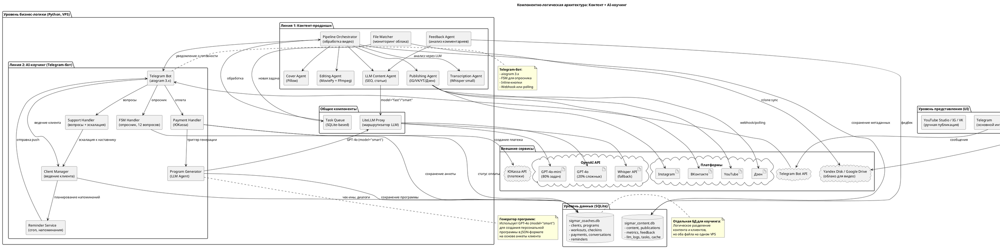

# Компонентно-логическая диаграмма

```puml
@startuml

skinparam componentStyle rectangle
title Компонентно-логическая архитектура: Контент + AI-коучинг

package "Уровень представления (UI)" {
    [CapCut / Movie Studio\n(творческий монтаж)] as Editor
    [Телефон\n(съемка + загрузка в облако)] as Phone
    [Telegram\n(основной интерфейс клиента)] as TG_Client
    [YouTube Studio / IG / VK\n(ручная публикация)] as Manual_Pub
}

package "Уровень бизнес-логики (Python, VPS)" {
    
    package "Линия 1: Контент-продакшн" {
        [File Watcher\n(мониторинг облака)] as Watcher
        [Pipeline Orchestrator\n(обработка видео)] as Pipeline
        [Transcription Agent\n(Whisper small)] as TransAg
        [Editing Agent\n(MoviePy + FFmpeg)] as EditAg
        [Cover Agent\n(Pillow)] as CoverAg
        [LLM Content Agent\n(SEO, статьи)] as LLMAg
        [Publishing Agent\n(IG/VK/YT/Дзен)] as PubAg
        [Feedback Agent\n(анализ комментариев)] as FeedAg
    }
    
    package "Линия 2: AI-коучинг (Telegram-бот)" {
        [Telegram Bot\n(aiogram 3.x)] as TGBot
        [FSM Handler\n(опросник, 12 вопросов)] as FSM
        [Payment Handler\n(ЮKassa)] as PayH
        [Program Generator\n(LLM Agent)] as ProgGen
        [Client Manager\n(ведение клиента)] as CM
        [Reminder Service\n(cron, напоминания)] as Rem
        [Support Handler\n(вопросы + эскалация)] as Sup
    }
    
    package "Общие компоненты" {
        [LiteLLM Proxy\n(маршрутизатор LLM)] as Router
        [Task Queue\n(SQLite-based)] as Queue
    }
}

package "Уровень данных (SQLite)" {
    database "sigmar_content.db\n- content, publications\n- metrics, feedback\n- llm_logs, tasks, cache" as DB_Content
    
    database "sigmar_coaches.db\n- clients, programs\n- workouts, checkins\n- payments, conversations\n- reminders" as DB_Coach
}

package "Внешние сервисы" {
    cloud "OpenAI API" as OAI {
        artifact "GPT-4o-mini\n(80% задач)" as Fast
        artifact "GPT-4o\n(20% сложных)" as Smart
        artifact "Whisper API\n(fallback)" as WhisperAPI
    }
    
    cloud "Telegram Bot API" as TG_API
    cloud "ЮKassa API\n(платежи)" as YK
    cloud "Yandex Disk / Google Drive\n(облако для видео)" as Cloud
    
    cloud "Платформы" as Platforms {
        artifact "Instagram" as IG
        artifact "ВКонтакте" as VK
        artifact "YouTube" as YT
        artifact "Дзен" as DZ
    }
}

' Контент-продакшн: связи
Phone --> Cloud : загрузка видео
Watcher --> Cloud : rclone sync
Watcher --> Queue : новая задача
Queue --> Pipeline : обработка
Pipeline --> TransAg
Pipeline --> EditAg
Pipeline --> CoverAg
Pipeline --> LLMAg
Pipeline --> PubAg
Pipeline --> DB_Content : сохранение метаданных
Pipeline --> TGBot : уведомление о готовности
FeedAg --> DB_Content : фидбек
FeedAg --> LLMAg : анализ через LLM

' AI-коучинг: связи
TG_Client --> TG_API : сообщения
TG_API --> TGBot : webhook/polling
TGBot --> FSM : опросник
TGBot --> PayH : оплата
TGBot --> CM : ведение клиента
TGBot --> Sup : вопросы

FSM --> DB_Coach : сохранение анкеты
PayH --> YK : создание платежа
PayH --> DB_Coach : статус оплаты
PayH --> ProgGen : триггер генерации

ProgGen --> Router : GPT-4o (model="smart")
ProgGen --> DB_Coach : сохранение программы

CM --> DB_Coach : чек-ины, диалоги
CM --> Rem : планирование напоминаний
Rem --> TGBot : отправка push

Sup --> CM : эскалация к наставнику

' Общие компоненты
LLMAg --> Router : model="fast"/"smart"
Router --> Fast
Router --> Smart
Router --> WhisperAPI

' Публикация
PubAg --> IG
PubAg --> VK
PubAg --> YT
PubAg --> DZ

note right of TGBot
  **Telegram-бот:**
  - aiogram 3.x
  - FSM для опросника
  - Inline-кнопки
  - Webhook или polling
end note

note bottom of ProgGen
  **Генератор программ:**
  Использует GPT-4o (model="smart")
  для создания персональной
  программы в JSON-формате
  на основе анкеты клиента
end note

note right of DB_Coach
  **Отдельная БД для коучинга:**
  Логическое разделение
  контента и клиентов,
  но оба файла на одном VPS
end note

@enduml

@enduml
```