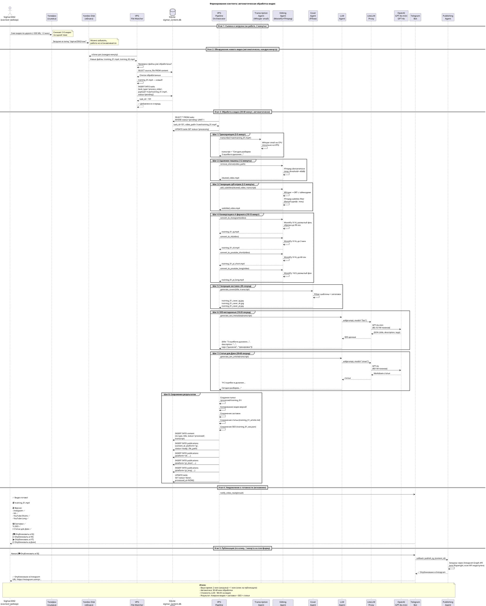

# Диаграммы последовательностей

## Формирование контента: автоматическая обработка видео 

```puml
@startuml
title Формирование контента: автоматическая обработка видео

actor "Sigmar2042\n(контент-мейкер)" as User
participant "Телефон\n(съемка)" as Phone
participant "Yandex Disk\n(облако)" as Cloud
participant "VPS:\nFile Watcher" as Watcher
database "SQLite\nsigmar_content.db" as DB
participant "VPS:\nPipeline\nOrchestrator" as Pipeline
participant "Transcription\nAgent\n(Whisper small)" as TransAg
participant "Editing\nAgent\n(MoviePy+FFmpeg)" as EditAg
participant "Cover\nAgent\n(Pillow)" as CoverAg
participant "LLM\nAgent" as LLMAg
participant "LiteLLM\nProxy" as Router
participant "OpenAI\nGPT-4o-mini\nGPT-4o" as LLM
participant "Telegram\nBot" as TG
participant "Publishing\nAgent" as PubAg

== Этап 1: Съемка и загрузка (на работе, 2 минуты) ==

User -> Phone : Снял видео по дороге (~500 МБ, 1-3 мин)
note right: Снимает 3-5 видео\nпо одной теме
Phone -> Cloud : Загрузил в папку "sigmar2042/raw/"
note right: Можно забывать,\nработа не останавливается

== Этап 2: Обнаружение нового видео (автоматически, каждую минуту) ==

Watcher -> Cloud : rclone sync (каждую минуту)
Cloud --> Watcher : Новые файлы: training_01.mp4, training_02.mp4
Watcher -> Watcher : Проверка: файлы уже обработаны?
Watcher -> DB : SELECT source_file FROM content
DB --> Watcher : Список обработанных
Watcher -> Watcher : training_01.mp4 — новый!
Watcher -> DB : INSERT INTO tasks\n(task_type='process_video',\npayload='/raw/training_01.mp4',\nstatus='pending')
DB --> Watcher : task_id = 101
Watcher --> Watcher : ✅ Добавлено в очередь

== Этап 3: Обработка видео (30-60 минут, автоматически) ==

Pipeline -> DB : SELECT * FROM tasks\nWHERE status='pending' LIMIT 1
DB --> Pipeline : task_id=101, video_path='/raw/training_01.mp4'
Pipeline -> DB : UPDATE tasks SET status='processing'

group Шаг 1: Транскрипция (3-5 минут)
    Pipeline -> TransAg : transcribe('/raw/training_01.mp4')
    TransAg -> TransAg : Whisper small на CPU\n(локально на VPS)
    TransAg --> Pipeline : transcript = "Сегодня разберем\n3 ошибки в дыхании..."
end

group Шаг 2: Удаление тишины (1-2 минуты)
    Pipeline -> EditAg : remove_silence(video_path)
    EditAg -> EditAg : FFmpeg silenceremove\n(stop_threshold=-40dB)
    EditAg --> Pipeline : cleaned_video.mp4
end

group Шаг 3: Генерация субтитров (2-3 минуты)
    Pipeline -> EditAg : add_subtitles(cleaned_video, transcript)
    EditAg -> EditAg : Whisper → SRT с таймкодами
    EditAg -> EditAg : FFmpeg subtitles filter\n(белый шрифт, тень)
    EditAg --> Pipeline : subtitled_video.mp4
end

group Шаг 4: Конвертация в 4 формата (10-15 минут)
    Pipeline -> EditAg : convert_to_instagram(video)
    EditAg -> EditAg : MoviePy: 9:16, размытый фон,\nобрезка до 90 сек
    EditAg --> Pipeline : training_01_ig.mp4
    
    Pipeline -> EditAg : convert_to_vk(video)
    EditAg -> EditAg : MoviePy: 9:16, до 3 мин
    EditAg --> Pipeline : training_01_vk.mp4
    
    Pipeline -> EditAg : convert_to_youtube_short(video)
    EditAg -> EditAg : MoviePy: 9:16, до 60 сек
    EditAg --> Pipeline : training_01_yt_short.mp4
    
    Pipeline -> EditAg : convert_to_youtube_long(video)
    EditAg -> EditAg : MoviePy: 16:9, размытый фон
    EditAg --> Pipeline : training_01_yt_long.mp4
end

group Шаг 5: Генерация заставок (30 секунд)
    Pipeline -> CoverAg : generate_covers(title, transcript)
    CoverAg -> CoverAg : Pillow: шаблоны + заголовок
    CoverAg --> Pipeline : training_01_cover_ig.jpg\ntraining_01_cover_vk.jpg\ntraining_01_cover_yt.jpg
end

group Шаг 6: SEO-метаданные (10-20 секунд)
    Pipeline -> LLMAg : generate_seo_metadata(transcript)
    LLMAg -> Router : ask(prompt, model="fast")
    Router -> LLM : GPT-4o-mini\n($0.15/1M токенов)
    LLM --> Router : JSON: {title, description, tags}
    Router --> LLMAg : SEO-данные
    LLMAg --> Pipeline : {title: "3 ошибки в дыхании...",\ndescription: "...",\ntags: ["дыхание", "тренировки"]}
end

group Шаг 7: Статья для Дзен (30-60 секунд)
    Pipeline -> LLMAg : generate_zen_article(transcript)
    LLMAg -> Router : ask(prompt, model="smart")
    Router -> LLM : GPT-4o\n($5/1M токенов)
    LLM --> Router : Markdown-статья
    Router --> LLMAg : статья
    LLMAg --> Pipeline : "# 3 ошибки в дыхании...\n\nСегодня разберем..."
end

group Шаг 8: Сохранение результатов
    Pipeline -> Pipeline : Создание папки\n/processed/training_01/
    Pipeline -> Pipeline : Копирование видео-версий
    Pipeline -> Pipeline : Сохранение заставок
    Pipeline -> Pipeline : Сохранение статьи (training_01_article.md)
    Pipeline -> Pipeline : Сохранение SEO (training_01_seo.json)
    
    Pipeline -> DB : INSERT INTO content\n(id, type, title, status='processed',\ntranscript)
    Pipeline -> DB : INSERT INTO publications\n(content_id, platform='ig',\nstatus='ready', file_path)
    Pipeline -> DB : INSERT INTO publications\n(platform='vk', ...)
    Pipeline -> DB : INSERT INTO publications\n(platform='yt_short', ...)
    Pipeline -> DB : INSERT INTO publications\n(platform='yt_long', ...)
    
    Pipeline -> DB : UPDATE tasks\nSET status='done',\nprocessed_at=NOW()
end

== Этап 4: Уведомление о готовности (мгновенно) ==

Pipeline -> TG : notify_video_ready(result)
TG --> User : ✅ Видео готово!\n\n📹 training_01.mp4\n\n🎬 Версии:\n- Instagram ✅\n- VK ✅\n- YouTube Shorts ✅\n- YouTube Long ✅\n\n🖼️ Заставки ✅\n🔍 SEO ✅\n📰 Статья для Дзен ✅\n\n[📷 Опубликовать в IG]\n[🔵 Опубликовать в VK]\n[▶️ Опубликовать в YT]\n[📰 Опубликовать в Дзен]

== Этап 5: Публикация (по клику, 1 минута на платформу) ==

User -> TG : Нажал [📷 Опубликовать в IG]
TG -> PubAg : callback: publish_ig_{content_id}
PubAg -> PubAg : Загрузка через Instagram Graph API\n(или Playwright, если API недоступен)
PubAg --> TG : ✅ Опубликовано в Instagram
TG --> User : ✅ Опубликовано в Instagram\nURL: https://instagram.com/p/...

note over User, PubAg
  **Итого:**
  - Ваше время: 2 мин (загрузка) + 1 мин (клик на публикацию)
  - Автоматика: 30-60 мин обработки
  - Стоимость LLM: ~$0.05 на видео
  - Результат: 4 версии видео + заставки + SEO + статья
end note

@enduml
```

## Путь клиента: от зрителя до платящего с AI-ведением

```puml
@startuml
title Путь клиента: от зрителя до платящего с AI-ведением

actor "Клиент\n(подписчик)" as Client
participant "Instagram /\nYouTube /\nДзен" as Platform
participant "Telegram\nBot (aiogram)" as Bot
participant "FSM Handler\n(опросник)" as FSM
database "SQLite\nsigmar_coaches.db" as DB
participant "Payment\nHandler" as Pay
participant "ЮKassa" as YK
participant "Program\nGenerator" as Gen
participant "LiteLLM\nProxy" as Router
participant "OpenAI\nGPT-4o" as LLM
participant "Client\nManager" as CM
participant "Reminder\nService" as Rem
actor "Sigmar2042\n(наставник)" as Coach

== Этап 1: Привлечение из контента ==

Client -> Platform : Смотрит видео Sigmar2042\n"3 ошибки в дыхании"
Platform --> Client : В описании: "Запишись на AI-коучинг:\n@sigmar2042_bot"
Client -> Bot : /start

== Этап 2: Опросник (FSM, 3-5 минут) ==

Bot -> FSM : начало диалога
FSM -> Client : 👋 Привет! Я — AI-ассистент Sigmar2042.\nСоставлю персональную программу тренировок.\n\nКак тебя зовут?
Client --> FSM : Александр
FSM -> DB : UPDATE state SET answer='Александр'
FSM -> Client : Приятно познакомиться, Александр!\nСколько тебе лет?
Client --> FSM : 35
FSM -> Client : Укажи рост (см) и вес (кг).\nНапример: 180 82
Client --> FSM : 180 82
FSM -> Client : Состояние здоровья:
FSM -> Client : [✅ Нет ограничений]\n[⚠️ Есть травмы]\n[🏥 Хронические]\n[❤️ Сердце/давление]
Client -> FSM : [⚠️ Есть травмы]
FSM -> Client : Расскажи подробнее, что именно?\nЭто важно для безопасной программы.
Client --> FSM : Старые травмы колена
FSM -> Client : Оцени по шкале 1-10:\n• Уровень стресса\n• Качество сна\n\nНапример: 7 5
Client --> FSM : 7 5
FSM -> Client : Текущая физическая активность:
FSM -> Client : [Не тренируюсь]\n[1-2 раза/нед]\n[3-4 раза/нед]\n[5+ раз/нед]
Client -> FSM : [1-2 раза/нед]
FSM -> Client : Тестовые нормативы (если знаешь):\n• Подтягивания (макс)\n• Отжимания за 1 мин\n• Планка (сек)
Client --> FSM : подтягивания 8, отжимания 30, планка 60
FSM -> Client : Главная цель:
FSM -> Client : [💪 Сила и масса]\n[🏃 Выносливость]\n[⚖️ Похудение]\n[🥋 Боевые искусства]\n[🧘 Здоровье]\n[🌬️ Дыхание]
Client -> FSM : [💪 Сила и масса]
FSM -> Client : Уровень в боевых искусствах:
FSM -> Client : [Нет опыта]\n[Новичок <1 года]\n[Средний 1-3 года]\n[Продвинутый 3+ лет]
Client -> FSM : [Новичок <1 года]
FSM -> Client : Где планируешь тренироваться:
FSM -> Client : [Дома без оборудования]\n[Дома: турник, гантели]\n[В зале]\n[На улице]
Client -> FSM : [Дома: турник, гантели]
FSM -> Client : Сколько времени готов уделять:
FSM -> Client : [20-30 мин, 3 раза/нед]\n[45-60 мин, 3-4 раза/нед]\n[60-90 мин, 4-5 раз/нед]
Client -> FSM : [45-60 мин, 3-4 раза/нед]
FSM -> Client : Дополнительно (что хочешь улучшить, комментарии):
Client --> FSM : Хочу подтянуть дыхание
FSM -> Client : 📋 Твоя анкета:\n\nИмя: Александр\nВозраст: 35\nРост/вес: 180/82\nЗдоровье: травмы колена\nЦель: Сила и масса\n...\n\nПодтвердить? [✅ Да] [✏️ Изменить]
Client -> FSM : [✅ Да]

FSM -> DB : INSERT INTO clients\n(telegram_id, username, full_name,\nage, height_cm, weight_kg,\nhealth_status='injuries',\nhealth_notes='травмы колена',\nstress_level=7, sleep_quality=5,\ncurrent_activity='1-2',\npull_ups_max=8, push_ups_1min=30,\nplank_sec=60, goal='strength',\nmartial_level='beginner',\ntraining_location='home_min',\ntime_per_session='45-60_3-4x',\nadditional_notes='Хочу подтянуть дыхание',\nstatus='lead')
DB --> FSM : client_id = 42

== Этап 3: Выбор тарифа и оплата ==

FSM -> Client : 🎯 Анкета заполнена!\n\nAI сгенерирует персональную программу.\n\nВыбери формат работы:
FSM -> Client : [🚀 Старт — 1 990 ₽]\nПрограмма на 4 недели\n\n[⭐ Про — 4 990 ₽/мес]\nПрограмма + ведение 3 месяца\n\n[💎 VIP — 15 000 ₽/мес]\nВсё из Про + личные созвоны
Client -> Bot : [⭐ Про — 4 990 ₽/мес]
Bot -> Pay : create_payment(client_id=42, tier='pro')
Pay -> DB : INSERT INTO payments\n(client_id=42, amount_rub=4990,\ntier='pro', status='pending')
Pay -> YK : POST /payments\n{\n  "amount": {"value": "4990", "currency": "RUB"},\n  "confirmation": {"type": "redirect", "return_url": "https://t.me/sigmar2042_bot"},\n  "capture": true,\n  "description": "Подписка Sigmar2042: Pro",\n  "metadata": {"client_id": 42, "tier": "pro"}\n}
YK --> Pay : {\n  "id": "payment_123",\n  "confirmation": {"confirmation_url": "https://yookassa.ru/..."}\n}
Pay --> Client : 💳 Оплати подписку:\nhttps://yookassa.ru/...
Client -> YK : Перешел по ссылке, оплатил картой
YK --> Pay : Webhook: payment.succeeded\n(payment_id=payment_123)
Pay -> DB : UPDATE payments\nSET status='paid',\nexternal_id='payment_123'
Pay -> DB : UPDATE clients\nSET subscription_tier='pro',\nsubscription_expires=NOW()+30 days,\nstatus='active'
Pay -> Gen : trigger: generate_program(client_id=42)

== Этап 4: Генерация программы (AI, 30-60 секунд) ==

Gen -> DB : SELECT * FROM clients WHERE id=42
DB --> Gen : Данные анкеты (все поля)
Gen -> Gen : Формирование промпта\nна основе анкеты
Gen -> Router : ask(prompt, model="smart")
Router -> LLM : GPT-4o\n($5/1M токенов)\n\nСистемный промпт:\n"Ты — Sigmar2042, эксперт...\nТвой подход: системность,\nдыхательные практики..."
LLM --> Router : JSON программы:\n{\n  "title": "Сила и дыхание: 4 недели",\n  "duration_weeks": 4,\n  "schedule": {\n    "monday": {...},\n    "wednesday": {...},\n    "friday": {...}\n  },\n  "breathing_exercises": {...},\n  "nutrition": [...],\n  "recovery": [...]\n}
Router --> Gen : программа (JSON)
Gen -> DB : INSERT INTO programs\n(client_id=42, version=1,\ntitle='Сила и дыхание: 4 недели',\nduration_weeks=4,\nschedule=JSON, breathing=JSON,\nis_active=1)
Gen -> DB : INSERT INTO workouts\n(program_id=1, day_number=1,\nscheduled_date='2026-07-23',\nexercises=JSON)\n-- для каждого дня программы
Gen --> Client : 🎯 Твоя программа готова!\n\n💪 Сила и дыхание: 4 недели\n\n📅 Расписание:\n• Пн: Сила верха + дыхание\n• Ср: Сила низа + выносливость\n• Пт: Комплекс + дыхательные практики\n\n🌬️ Дыхательные техники:\n• Утро: 5 мин диафрагмальное дыхание\n• Перед тренировкой: 3 мин техника "4-7-8"\n\n📝 Завтра в 07:00 получишь первую тренировку!\n\nЕсть вопросы? Напиши /help

== Этап 5: Ежедневное ведение (автоматически, каждый день тренировки) ==

loop Каждый день тренировки (Пн/Ср/Пт)
    
    group 07:00 — Утреннее напоминание
        Rem -> DB : SELECT * FROM workouts\nWHERE client_id=42\nAND scheduled_date=TODAY
        DB --> Rem : workout_id=101,\nexercises=JSON, focus='Сила верха'
        Rem -> Bot : send_workout_plan(client_id=42)
        Bot --> Client : ☀️ Доброе утро, Александр!\n\nСегодня тренировка: Сила верха + дыхание\n\n🔥 Разминка (5 мин):\n• Суставная гимнастика\n• Наклоны\n• Круговые движения руками\n\n💪 Основная часть:\n1. Подтягивания: 4×8-10 (отдых 90 сек)\n2. Отжимания: 4×15-20\n3. Тяга гантели в наклоне: 3×12\n4. Жим гантелей стоя: 3×10\n\n🧘 Заминка:\n• Растяжка верха тела\n• Шавасана 2 мин\n\n🌬️ Дыхание:\n• Техника "4-7-8" — 5 мин\n\n<i>Напиши /done после тренировки</i>
    end
    
    group Клиент выполняет тренировку
        Client -> Bot : /done "Тренировка выполнена"
        Bot -> CM : mark_workout_done(client_id=42, workout_id=101)
        CM -> DB : UPDATE workouts\nSET completed=1,\ncompleted_at=NOW()
        Bot --> Client : ✅ Отлично! Тренировка засчитана.\n\nКак себя чувствуешь? Оцени сложность 1-10
        Client --> Bot : 7
        CM -> DB : UPDATE workouts\nSET difficulty_rating=7,\nclient_notes='Хорошо пошла тяга'
    end
    
    group 19:00 — Вечерний чек-ин
        Rem -> Bot : send_evening_checkin(client_id=42)
        Bot --> Client : 💬 Как прошла тренировка?\n\nОцени:\n• Сложность (1-10)\n• Энергию после (1-10)\n\nЧто почувствовал?
        Client --> Bot : Сложность 7, энергия 8.\nЧувствую силу в руках, но колено немного ныло
        CM -> CM : Анализ через LLM
        CM -> Router : ask(prompt, model="smart")
        Router -> LLM : GPT-4o анализирует:\n"Колено ныло — нужно скорректировать\nупражнения для ног, добавить разминку"
        LLM --> Router : рекомендации
        Router --> CM : "Снизить нагрузку на колено,\nдобавить упражнения для стабилизации"
        CM -> DB : INSERT INTO conversations\n(client_id=42, role='assistant',\ncontent='Рекомендации...')
        CM --> Client : 👍 Понял! Завтра добавлю разминку для колена\nи заменю приседания на более щадящие.\n\nСпасибо за обратную связь!
    end
    
end

== Этап 6: Еженедельный чек-ин + корректировка программы (каждое воскресенье) ==

loop Каждое воскресенье, 20:00
    
    Rem -> Bot : send_weekly_checkin(client_id=42)
    Bot --> Client : 📊 Еженедельный чек-ин\n\nОтветь на вопросы:\n1. Вес (кг)\n2. Энергия (1-10)\n3. Качество сна (1-10)\n4. Настроение (1-10)\n5. Сколько тренировок выполнил?\n6. Что получилось? Что нет?
    
    Client --> Bot : 1. 81 кг\n2. 7\n3. 6\n4. 7\n5. 3 тренировки\n6. Подтягивания пошли лучше, но колено все еще беспокоит
    
    Bot -> CM : save_checkin(client_id=42, data)
    CM -> DB : INSERT INTO checkins\n(client_id=42, week_number=1,\nweight_kg=81, energy_level=7,\nsleep_quality=6, mood=7,\nworkouts_completed=3,\nnotes='Подтягивания лучше, колено беспокоит')
    
    CM -> Gen : adjust_program(current_program, checkin)
    Gen -> DB : SELECT * FROM programs\nWHERE client_id=42 AND is_active=1
    DB --> Gen : текущая программа (version=1)
    Gen -> Gen : Формирование промпта\nс текущей программой + чек-ин
    Gen -> Router : ask(prompt, model="smart")
    Router -> LLM : GPT-4o анализирует:\n"Вес -1 кг, энергия 7/10.\nКолено беспокоит — нужно:\n1. Заменить приседания на степ-апы\n2. Добавить упражнения для стабилизации\n3. Увеличить объем на 10%"
    LLM --> Router : скорректированная программа (JSON)
    Router --> Gen : новая программа
    Gen -> DB : INSERT INTO programs\n(client_id=42, version=2,\nschedule=JSON, is_active=1)
    Gen -> DB : UPDATE programs\nSET is_active=0 WHERE version=1
    Gen -> DB : INSERT INTO workouts\n(новая программа на неделю 2)
    
    Gen --> Client : 📈 Программа на неделю 2 скорректирована:\n\n✅ Прогресс:\n• Вес: -1 кг (82 → 81)\n• Подтягивания: +2 повторения\n\n🔧 Корректировки:\n• Заменил приседания на степ-апы (щадит колено)\n• Добавил упражнения для стабилизации колена\n• Увеличил объем на 10%\n\n🎯 Цели на неделю 2:\n• Подтягивания: 4×10\n• Вес: 80.5 кг\n\nУдачи! 💪
    
end

== Этап 7: Эскалация к наставнику (редко, только сложные случаи) ==

Client -> Bot : "У меня сильно болит колено после вчерашней тренировки"
Bot -> CM : analyze_message(client_id=42, message)
CM -> Router : ask(prompt, model="smart")
Router -> LLM : GPT-4o оценивает:\n"Сильная боль — это не обычная крепатура.\nТребуется консультация наставника.\nЭскалация."
LLM --> Router : "Эскалация к наставнику"
Router --> CM : эскалация
CM -> DB : INSERT INTO conversations\n(client_id=42, role='system',\ncontent='Эскалация к наставнику')
CM -> Bot : notify_coach(client_id=42, issue='боль в колене')
Bot --> Coach : ⚠️ Клиент #42 (Александр)\nЖалуется на сильную боль в колене.\nТребуется ваша консультация.
Coach -> Bot : "Александр, давай созвонимся в Zoom завтра в 19:00"
Bot --> Client : 📞 Наставник хочет с тобой связаться.\nЗавтра в 19:00 созвон в Zoom.\nСсылка придет за час до встречи.

note over Client, Coach
  **Итог пути клиента:**
  - 5 минут: анкета + оплата
  - 1 минута: получение программы
  - 5 минут/неделю: чек-ины
  - 0 рублей на человека: AI делает 95% работы
  - Только сложные случаи → наставник (эскалация)
  
  **Стоимость LLM на клиента:**
  - Генерация программы: ~$0.10
  - Еженедельная корректировка: ~$0.05 × 4 = $0.20
  - Ежедневные ответы: ~$0.01 × 30 = $0.30
  - **Итого: ~$0.60/мес на клиента**
  
  **Маржинальность:** ~85%
end note

@enduml
```