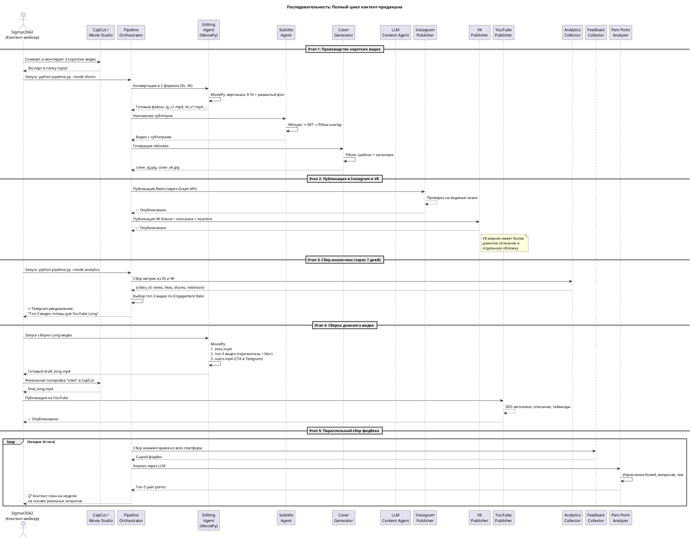
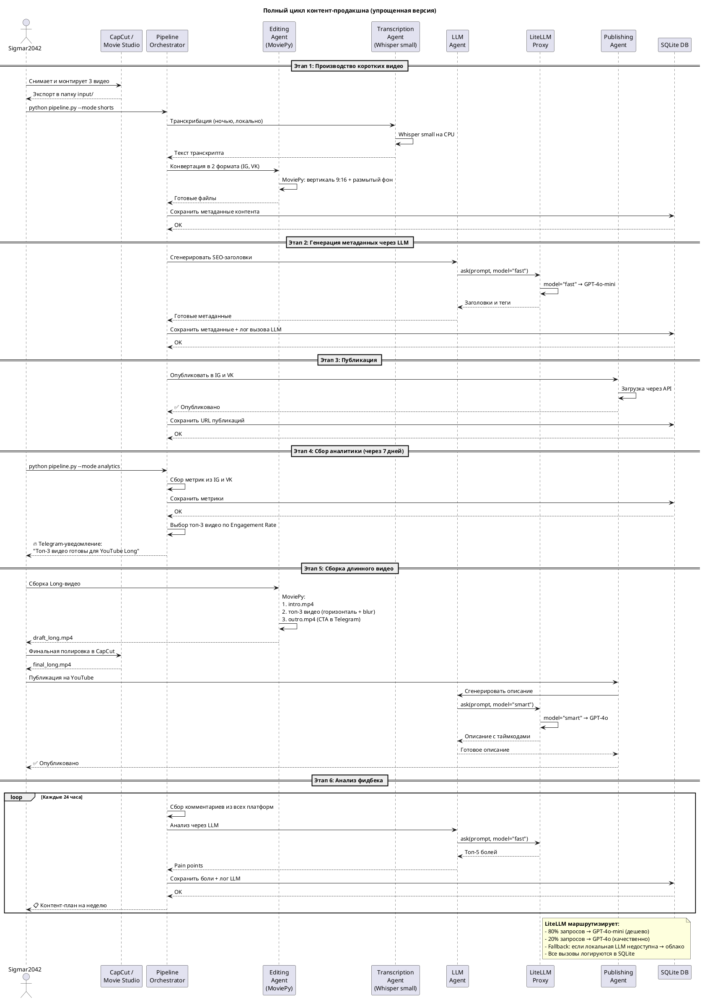

# Диаграммы последовательностей

```puml
@startuml
title Последовательность: Полный цикл контент-продакшна

actor "Sigmar2042\n(Контент-мейкер)" as User
participant "CapCut /\nMovie Studio" as Editor
participant "Pipeline\nOrchestrator" as Orch
participant "Editing\nAgent\n(MoviePy)" as EditAg
participant "Subtitle\nAgent" as SubAg
participant "Cover\nGenerator" as CoverAg
participant "LLM\nContent Agent" as LLM
participant "Instagram\nPublisher" as IG
participant "VK\nPublisher" as VK
participant "YouTube\nPublisher" as YT
participant "Analytics\nCollector" as An
participant "Feedback\nCollector" as FB
participant "Pain Point\nAnalyzer" as PP

== Этап 1: Производство коротких видео ==

User -> Editor : Снимает и монтирует 3 коротких видео
Editor --> User : Экспорт в папку input/
User -> Orch : Запуск: python pipeline.py --mode shorts

Orch -> EditAg : Конвертация в 2 формата (IG, VK)
EditAg -> EditAg : MoviePy: вертикаль 9:16 + размытый фон
EditAg --> Orch : Готовые файлы: ig_v1.mp4, vk_v1.mp4 ...

Orch -> SubAg : Наложение субтитров
SubAg -> SubAg : Whisper → SRT → Pillow overlay
SubAg --> Orch : Видео с субтитрами

Orch -> CoverAg : Генерация обложек
CoverAg -> CoverAg : Pillow: шаблон + заголовок
CoverAg --> Orch : cover_ig.jpg, cover_vk.jpg

== Этап 2: Публикация в Instagram и VK ==

Orch -> IG : Публикация Reels (через Graph API)
IG --> IG : Проверка на водяные знаки
IG --> Orch : ✅ Опубликовано

Orch -> VK : Публикация VK Клипа + описание + хештеги
VK --> Orch : ✅ Опубликовано

note right of VK : VK-версия имеет более\nдлинное описание и\nотдельную обложку

== Этап 3: Сбор аналитики (через 7 дней) ==

User -> Orch : Запуск: python pipeline.py --mode analytics

Orch -> An : Сбор метрик из IG и VK
An --> Orch : {video_id: views, likes, shares, retention}

Orch -> Orch : Выбор топ-3 видео по Engagement Rate
Orch --> User : 🔥 Telegram-уведомление:\n"Топ-3 видео готовы для YouTube Long"

== Этап 4: Сборка длинного видео ==

User -> EditAg : Запуск сборки Long-видео
EditAg -> EditAg : MoviePy:\n1. intro.mp4\n2. топ-3 видео (горизонталь + blur)\n3. outro.mp4 (CTA в Telegram)
EditAg --> User : Готовый draft_long.mp4

User -> Editor : Финальная полировка "клея" в CapCut
Editor --> User : final_long.mp4

User -> YT : Публикация на YouTube
YT --> YT : SEO-заголовок, описание, таймкоды
YT --> User : ✅ Опубликовано

== Этап 5: Параллельный сбор фидбека ==

loop Каждые 24 часа
    Orch -> FB : Сбор комментариев из всех платформ
    FB --> Orch : Сырой фидбек
    
    Orch -> PP : Анализ через LLM
    PP -> PP : Извлечение болей, вопросов, тем
    PP --> Orch : Топ-5 pain points
    
    Orch --> User : 📋 Контент-план на неделю\nна основе реальных запросов
end

@enduml
```

```puml
@startuml
title Полный цикл контент-продакшна (упрощенная версия)

actor "Sigmar2042" as User
participant "CapCut /\nMovie Studio" as Editor
participant "Pipeline\nOrchestrator" as Orch
participant "Editing\nAgent\n(MoviePy)" as EditAg
participant "Transcription\nAgent\n(Whisper small)" as TransAg
participant "LLM\nAgent" as LLM
participant "LiteLLM\nProxy" as Router
participant "Publishing\nAgent" as PubAg
participant "SQLite DB" as DB

== Этап 1: Производство коротких видео ==

User -> Editor : Снимает и монтирует 3 видео
Editor --> User : Экспорт в папку input/
User -> Orch : python pipeline.py --mode shorts

Orch -> TransAg : Транскрибация (ночью, локально)
TransAg -> TransAg : Whisper small на CPU
TransAg --> Orch : Текст транскрипта

Orch -> EditAg : Конвертация в 2 формата (IG, VK)
EditAg -> EditAg : MoviePy: вертикаль 9:16 + размытый фон
EditAg --> Orch : Готовые файлы

Orch -> DB : Сохранить метаданные контента
DB --> Orch : OK

== Этап 2: Генерация метаданных через LLM ==

Orch -> LLM : Сгенерировать SEO-заголовки
LLM -> Router : ask(prompt, model="fast")
Router -> Router : model="fast" → GPT-4o-mini
Router --> LLM : Заголовки и теги
LLM --> Orch : Готовые метаданные

Orch -> DB : Сохранить метаданные + лог вызова LLM
DB --> Orch : OK

== Этап 3: Публикация ==

Orch -> PubAg : Опубликовать в IG и VK
PubAg -> PubAg : Загрузка через API
PubAg --> Orch : ✅ Опубликовано

Orch -> DB : Сохранить URL публикаций
DB --> Orch : OK

== Этап 4: Сбор аналитики (через 7 дней) ==

User -> Orch : python pipeline.py --mode analytics

Orch -> Orch : Сбор метрик из IG и VK
Orch -> DB : Сохранить метрики
DB --> Orch : OK

Orch -> Orch : Выбор топ-3 видео по Engagement Rate
Orch --> User : 🔥 Telegram-уведомление:\n"Топ-3 видео готовы для YouTube Long"

== Этап 5: Сборка длинного видео ==

User -> EditAg : Сборка Long-видео
EditAg -> EditAg : MoviePy:\n1. intro.mp4\n2. топ-3 видео (горизонталь + blur)\n3. outro.mp4 (CTA в Telegram)
EditAg --> User : draft_long.mp4

User -> Editor : Финальная полировка в CapCut
Editor --> User : final_long.mp4

User -> PubAg : Публикация на YouTube
PubAg -> LLM : Сгенерировать описание
LLM -> Router : ask(prompt, model="smart")
Router -> Router : model="smart" → GPT-4o
Router --> LLM : Описание с таймкодами
LLM --> PubAg : Готовое описание
PubAg --> User : ✅ Опубликовано

== Этап 6: Анализ фидбека ==

loop Каждые 24 часа
    Orch -> Orch : Сбор комментариев из всех платформ
    Orch -> LLM : Анализ через LLM
    LLM -> Router : ask(prompt, model="fast")
    Router --> LLM : Топ-5 болей
    LLM --> Orch : Pain points
    
    Orch -> DB : Сохранить боли + лог LLM
    DB --> Orch : OK
    
    Orch --> User : 📋 Контент-план на неделю
end

note right of Router
  **LiteLLM маршрутизирует:**
  - 80% запросов → GPT-4o-mini (дешево)
  - 20% запросов → GPT-4o (качественно)
  - Fallback: если локальная LLM недоступна → облако
  - Все вызовы логируются в SQLite
end note

@enduml
```