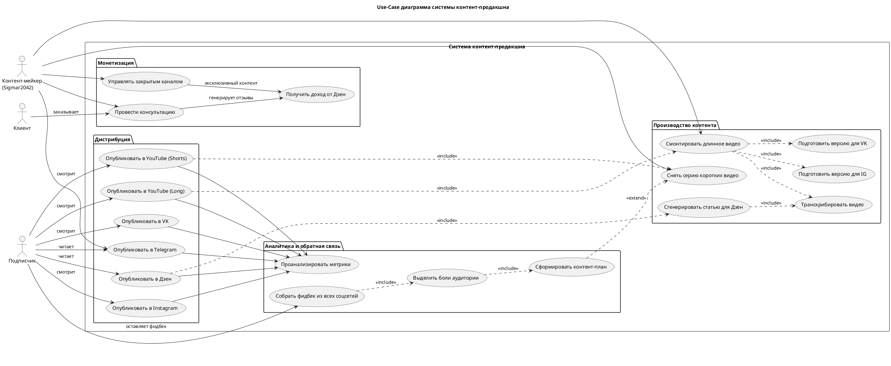
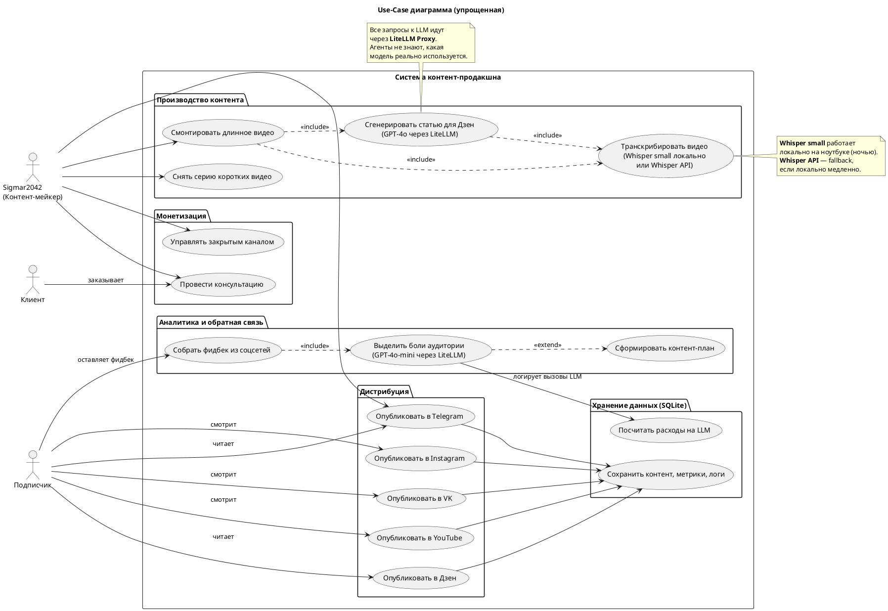

# Use-case

```puml
@startuml
left to right direction
title Use-Case диаграмма системы контент-продакшна

actor "Контент-мейкер\n(Sigmar2042)" as Creator
actor "Подписчик" as Subscriber
actor "Клиент" as Client

rectangle "Система контент-продакшна" {
    
    package "Производство контента" {
        usecase "Снять серию коротких видео" as UC1
        usecase "Смонтировать длинное видео" as UC2
        usecase "Транскрибировать видео" as UC3
        usecase "Сгенерировать статью для Дзен" as UC4
        usecase "Подготовить версию для VK" as UC5
        usecase "Подготовить версию для IG" as UC6
    }
    
    package "Дистрибуция" {
        usecase "Опубликовать в Instagram" as UC7
        usecase "Опубликовать в VK" as UC8
        usecase "Опубликовать в YouTube (Long)" as UC9
        usecase "Опубликовать в YouTube (Shorts)" as UC10
        usecase "Опубликовать в Telegram" as UC11
        usecase "Опубликовать в Дзен" as UC12
    }
    
    package "Аналитика и обратная связь" {
        usecase "Собрать фидбек из всех соцсетей" as UC13
        usecase "Выделить боли аудитории" as UC14
        usecase "Сформировать контент-план" as UC15
        usecase "Проанализировать метрики" as UC16
    }
    
    package "Монетизация" {
        usecase "Провести консультацию" as UC17
        usecase "Управлять закрытым каналом" as UC18
        usecase "Получить доход от Дзен" as UC19
    }
}

Creator --> UC1
Creator --> UC2
Creator --> UC11
Creator --> UC17
Creator --> UC18

Subscriber --> UC7 : смотрит
Subscriber --> UC8 : смотрит
Subscriber --> UC9 : смотрит
Subscriber --> UC10 : смотрит
Subscriber --> UC11 : читает
Subscriber --> UC12 : читает
Subscriber --> UC13 : оставляет фидбек

Client --> UC17 : заказывает

UC2 ..> UC3 : <<include>>
UC2 ..> UC5 : <<include>>
UC2 ..> UC6 : <<include>>
UC9 ..> UC2 : <<include>>
UC10 ..> UC1 : <<include>>
UC12 ..> UC4 : <<include>>
UC4 ..> UC3 : <<include>>

UC13 ..> UC14 : <<include>>
UC14 ..> UC15 : <<include>>
UC15 ..> UC1 : <<extend>>

UC7 --> UC16
UC8 --> UC16
UC9 --> UC16
UC10 --> UC16
UC11 --> UC16
UC12 --> UC16

UC17 --> UC19 : генерирует отзывы
UC18 --> UC19 : эксклюзивный контент

@enduml
```

```puml
@startuml
left to right direction
title Use-Case диаграмма (упрощенная)

actor "Sigmar2042\n(Контент-мейкер)" as Creator
actor "Подписчик" as Subscriber
actor "Клиент" as Client

rectangle "Система контент-продакшна" {
    
    package "Производство контента" {
        usecase "Снять серию коротких видео" as UC1
        usecase "Смонтировать длинное видео" as UC2
        usecase "Транскрибировать видео\n(Whisper small локально\nили Whisper API)" as UC3
        usecase "Сгенерировать статью для Дзен\n(GPT-4o через LiteLLM)" as UC4
    }
    
    package "Дистрибуция" {
        usecase "Опубликовать в Instagram" as UC7
        usecase "Опубликовать в VK" as UC8
        usecase "Опубликовать в YouTube" as UC9
        usecase "Опубликовать в Telegram" as UC11
        usecase "Опубликовать в Дзен" as UC12
    }
    
    package "Аналитика и обратная связь" {
        usecase "Собрать фидбек из соцсетей" as UC13
        usecase "Выделить боли аудитории\n(GPT-4o-mini через LiteLLM)" as UC14
        usecase "Сформировать контент-план" as UC15
    }
    
    package "Монетизация" {
        usecase "Провести консультацию" as UC17
        usecase "Управлять закрытым каналом" as UC18
    }
    
    package "Хранение данных (SQLite)" {
        usecase "Сохранить контент, метрики, логи" as UC20
        usecase "Посчитать расходы на LLM" as UC21
    }
}

Creator --> UC1
Creator --> UC2
Creator --> UC11
Creator --> UC17
Creator --> UC18

Subscriber --> UC7 : смотрит
Subscriber --> UC8 : смотрит
Subscriber --> UC9 : смотрит
Subscriber --> UC11 : читает
Subscriber --> UC12 : читает
Subscriber --> UC13 : оставляет фидбек

Client --> UC17 : заказывает

UC2 ..> UC3 : <<include>>
UC2 ..> UC4 : <<include>>
UC4 ..> UC3 : <<include>>

UC13 ..> UC14 : <<include>>
UC14 ..> UC15 : <<extend>>

UC7 --> UC20
UC8 --> UC20
UC9 --> UC20
UC11 --> UC20
UC12 --> UC20
UC14 --> UC21 : логирует вызовы LLM

note right of UC3
  **Whisper small** работает
  локально на ноутбуке (ночью).
  **Whisper API** — fallback,
  если локально медленно.
end note

note bottom of UC4
  Все запросы к LLM идут
  через **LiteLLM Proxy**.
  Агенты не знают, какая
  модель реально используется.
end note

@enduml
```